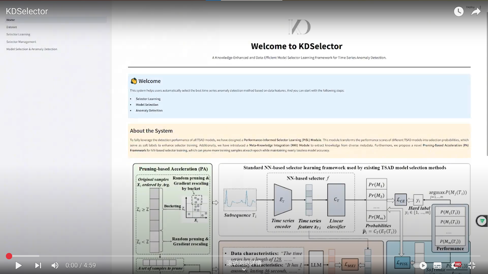
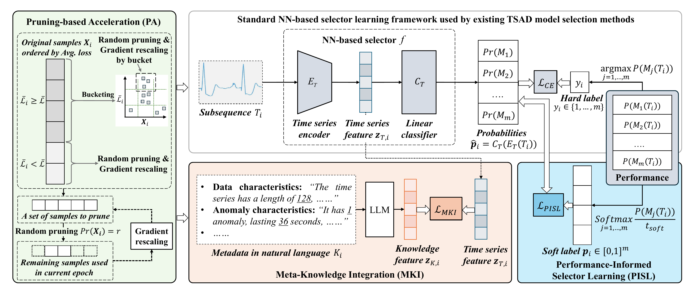

<p align="center">

</p>


<h1 align="center">KDSelector
</h1>
<h2 align="center"> A Knowledge-Enhanced and Data-Efficient Model Selector Learning Framework for Time Series Anomaly Detection</h2>

KDSelector proposes a novel knowledge-enhanced and data-efficient framework for learning a neural network (NN)-based model selector in the context of time series anomaly detection (TSAD). It aims to address the limitations of existing model selection methods, which often fail to fully utilize the knowledge in historical data and are inefficient in terms of training speed. 

[]( https://youtu.be/2uqupDWvTF0.)

## Framework

We introduce a novel neural network (NN)-based selector learning framework, which serves as the core component of our system. For a comprehensive understanding of its architecture and implementation, please refer to the detailed technical report available at [KDSelector Technical Report](https://github.com/chenyuanTKCY/KDSelector/blob/master/report/KDSelector%20Technical%20Report.pdf).


<!-- 
<iframe src="https://pdf-embed-api.com/?url=https://github.com/chenyuanTKCY/KDSelector/blob/master/app/fig/framework.pdf" width="100%" height="600px"></iframe> -->

### Reference

> Zhiyu Liang, Dongrui Cai, Chenyuan Zhang, Zheng Liang, Chen Liang, Bo Zheng, Shi Qiu, Jin Wang, and Hongzhi Wang. 2025. KDSelector: A Knowledge-Enhanced and Data-Efficient Model Selector Learning Framework for Time Series Anomaly Detection. In Companion of the 2025 International Conference on Management of Data (SIGMOD-Companion ’25), June 22–27, 2025, Berlin, Germany. 

## Installation

To install KDSelector from source, you will need the following tools:
- `git`
- `conda` (anaconda or miniconda)

#### Packages and tools setting

The following key tools and their versions are used in this project:
- **Python**
  - python==3.8.20

- **Machine Learning and Deep Learning**
  - scikit-learn==1.3.2
  - torch==1.13.

For the complete list of dependencies, please refer to the `environment.yml` and `requirements.txt` files.

#### Steps for installation

**Step 1:** Clone this repository using `git` and change into its root directory.

```bash
git clone https://github.com/chenyuanTKCY/KDSelector.git
cd KDSelector/
```

**Step 2:** Create and activate a `conda` environment named `KDSelector`.

```bash
conda env create --file environment.yml
conda activate KDSelector
```
> Note: If you plan to use GPU acceleration, please ensure that you have CUDA installed. You can refer to the [CUDA installation instructions](https://developer.nvidia.com/cuda-downloads) for guidance.
   
If you do not wish to create the `conda` environment, you can install only the dependencies listed in `requirements.txt` using the following command:
```
pip install -r requirements.txt
```

**Step 3:** :clap: Installation complete! :clap:

Start our system using the following command:
```bash
streamlit run app/Home.py
```

