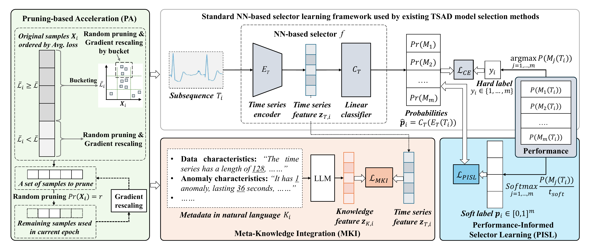

<p align="center">
  
</p>

<h1 align="center">KDSelector</h1>

<p align="center">
  <strong>A knowledge-enhanced, data-efficient model selector for time-series anomaly detection</strong>
</p>

<p align="center">
  
  
  
</p>

KDSelector learns to recommend a suitable anomaly detector for an unseen time
series. It reuses knowledge from historical benchmark results and reduces
selector-training cost with data-efficient learning.

<p align="center">
  
</p>

## Highlights

- **Knowledge-enhanced selection** — learns from historical detector performance
  instead of evaluating every detector from scratch.
- **Data-efficient training** — integrates InfoBatch to reduce redundant training
  samples.
- **Broad model support** — includes deep selectors and conventional
  feature-based classifiers.
- **End-to-end interface** — provides a Streamlit workflow for dataset loading,
  selector training, selector management, and anomaly detection.
- **Multiple evaluation metrics** — ships benchmark scores for AUC-ROC, AUC-PR,
  VUS-ROC, and VUS-PR.

## Supported methods

| Component | Implementations |
| --- | --- |
| Deep selectors | ConvNet, InceptionTime, ResNet, SiT |
| Feature-based selectors | k-NN, linear SVC, decision tree, random forest, MLP, AdaBoost, Gaussian NB, QDA |
| Anomaly detectors | AE, CNN, HBOS, Isolation Forest, LOF, LSTM, Matrix Profile, NORMA, OCSVM, PCA, POLY |

## Quick start

### 1. Clone the repository

```bash
git clone https://github.com/chenyuanTKCY/KDSelector.git
cd KDSelector
```

### 2. Create the environment

Conda is recommended because the project targets Python 3.8 and pins its main
machine-learning dependencies.

```bash
conda env create --file environment.yml
conda activate KDSelector
```

Alternatively, install the Python dependencies directly:

```bash
python -m pip install -r requirements.txt
```

> GPU acceleration requires a CUDA setup compatible with the pinned PyTorch
> version. The application can also run on CPU.

### 3. Launch the application

Run this command from the repository root:

```bash
streamlit run app/Home.py
```

The application opens in your browser and guides you through four stages:
dataset preparation, selector learning, selector management, and model
selection with anomaly detection.

## Command-line training

Train a deep selector:

```bash
python train_deep_model.py \
  --path <dataset-directory> \
  --model convnet \
  --params models/configuration/convnet_default.json \
  --eval-true
```

Train a feature-based selector:

```bash
python train_feature_based.py \
  --path <dataset-directory> \
  --classifier random_forest \
  --eval-true
```

Use `--help` with either script to see every training option.

## Repository layout

```text
KDSelector/
├── app/                 # Streamlit application and detector integrations
├── data/                # Benchmark metric tables
├── InfoBatch/           # Data-efficient training implementation
├── models/              # Selector architectures and configurations
├── report/              # Technical report
├── utils/               # Data loading, evaluation, and training utilities
├── train_*.py           # Selector training entry points
└── eval_*.py            # Selector evaluation entry points
```

## Resources

- [Technical report](report/KDSelector%20Technical%20Report.pdf)
- [Video demonstration](https://youtu.be/2uqupDWvTF0)
- [SIGMOD 2025](https://2025.sigmod.org/)

## Citation

If KDSelector supports your research, please cite:

```bibtex
@inproceedings{liang2025kdselector,
  title     = {KDSelector: A Knowledge-Enhanced and Data-Efficient Model
               Selector Learning Framework for Time Series Anomaly Detection},
  author    = {Liang, Zhiyu and Cai, Dongrui and Zhang, Chenyuan and
               Liang, Zheng and Liang, Chen and Zheng, Bo and Qiu, Shi and
               Wang, Jin and Wang, Hongzhi},
  booktitle = {Companion of the 2025 International Conference on Management
               of Data},
  year      = {2025}
}
```

For implementation details and experimental context, see the
[technical report](report/KDSelector%20Technical%20Report.pdf).
